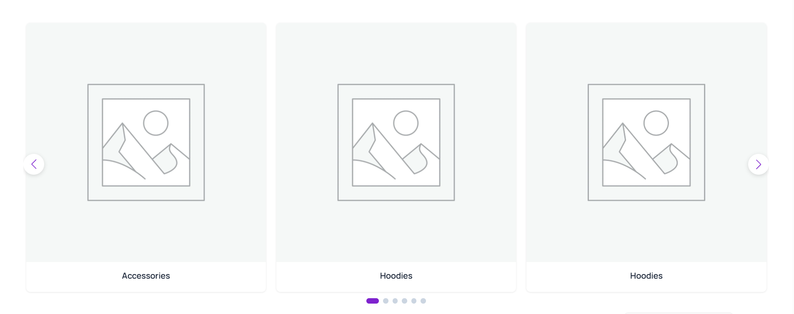
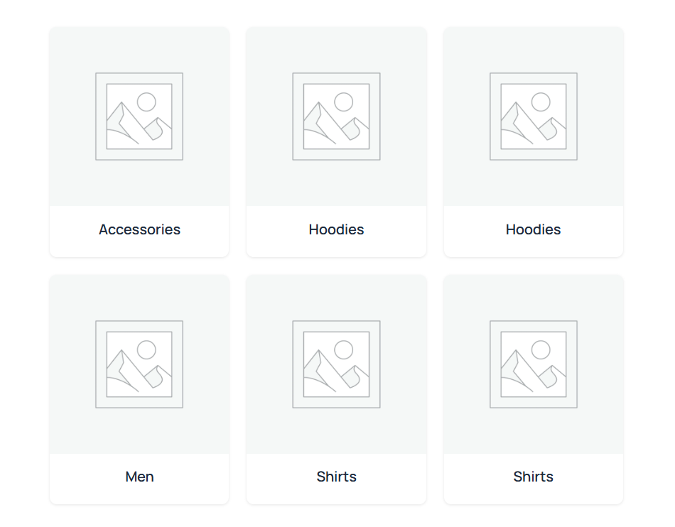
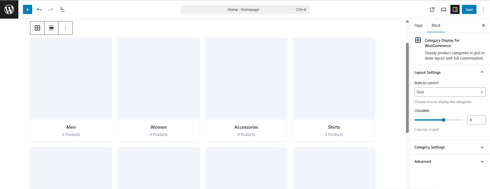

# Category Display for WooCommerce

> A lightweight native Gutenberg block to display WooCommerce product categories
> in beautiful grid or slider layouts — with live editor preview.


---

## Why This Plugin?

Most category display solutions are locked inside bloated page builders
or require a paid plugin. This is a free, lightweight native Gutenberg
block — no page builder needed, no upsells.

---

## Features

- **Grid Layout** — Responsive grid with 1–6 columns
- **Slider Layout** — Touch-enabled carousel (Swiper.js, bundled locally)
- **Live Editor Preview** — See real categories inside the block editor
- **Sort & Filter** — Sort by name, count, ID or slug
- **Product Count** — Show/hide count per category
- **Hide Empty Categories** — Toggle on/off
- **Fully Responsive** — Mobile, tablet, desktop
- **No CDN** — Swiper bundled locally, no external requests
- **Translation Ready** — Fully internationalised

---

## Screenshots

<!-- Add screenshots here after uploading images to /assets folder in repo -->

**Grid Layout**


**Slider Layout**


**Live Editor Preview**


---

## Installation

### From WordPress.org

1. Go to **Plugins → Add New**
2. Search **Category Display for WooCommerce**
3. Click **Install Now** then **Activate**

### Manual

1. Download the ZIP from [Releases](https://github.com/jenish-wordpress/woocommerce-categories-gutenberg-block/releases)
2. Go to **Plugins → Add New → Upload Plugin**
3. Upload and activate

### Requirements

- WordPress 6.0+
- WooCommerce 6.0+
- PHP 7.4+

---

## Development Setup

```bash
# Clone the repo
git clone https://github.com/jenish-wordpress/woocommerce-categories-gutenberg-block.git

# Install dependencies
npm install

# Start development (watch mode)
npm run start

# Build for production
npm run build
```

### Folder Structure

```
category-display-for-woocommerce/
├── assets/          # Swiper bundle + frontend JS/CSS
├── build/           # Compiled block files (after npm run build)
├── src/
│   ├── block.json   # Block metadata
│   ├── index.js     # Block registration
│   ├── edit.js      # Editor component (live preview)
│   ├── render.php   # Frontend render callback
│   ├── style.scss   # Frontend styles
│   └── editor.scss  # Editor-only styles
├── category-display-for-woocommerce.php
└── readme.txt
```

---

## CSS Classes for Customisation

```css
.cat-display-block        /* Main container */
.cat-display-layout-grid  /* Grid layout */
.cat-display-layout-slider /* Slider layout */
.cat-display-item         /* Individual category card */
.cat-display-title        /* Category name */
.cat-display-count        /* Product count */
```

---

## Contributing

Pull requests are welcome! For major changes please open an issue first.

1. Fork the repo
2. Create your branch (`git checkout -b feature/your-feature`)
3. Commit your changes (`git commit -m 'Add some feature'`)
4. Push to the branch (`git push origin feature/your-feature`)
5. Open a Pull Request

---

## Changelog

### 1.0.0

- Initial release
- Grid and slider layouts
- Live editor preview
- Sort, filter, count controls

---

## License

GPL v2 or later — see [LICENSE](LICENSE) for details.

---

## Author

**Jenish Dholakiya**  
GitHub: [@jenish-wordpress](https://github.com/jenish-wordpress)  
WordPress.org: [View Plugin](https://wordpress.org/plugins/category-display-for-woocommerce)
