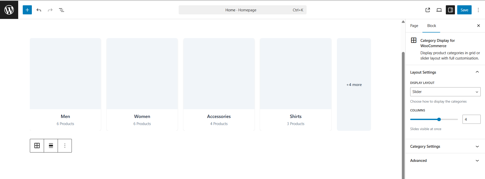
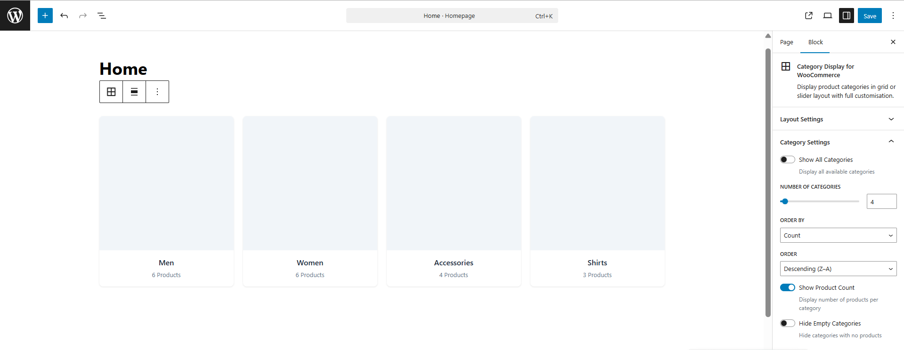

# Category Display for WooCommerce — Free Gutenberg Block Plugin

[](https://wordpress.org)
[](https://woocommerce.com)
[](https://php.net)
[](https://www.gnu.org/licenses/gpl-2.0.html)
[](https://github.com/jenish-wordpress/woocommerce-categories-gutenberg-block/stargazers)
[](https://github.com/jenish-wordpress/woocommerce-categories-gutenberg-block/network/members)

> **Free native Gutenberg block to display WooCommerce product categories in a responsive grid or slider layout — with live editor preview, no page builder required.**

📦 [Download Latest Release](https://github.com/jenish-wordpress/woocommerce-categories-gutenberg-block/releases)
&nbsp;|&nbsp;
🐛 [Report a Bug](https://github.com/jenish-wordpress/woocommerce-categories-gutenberg-block/issues)
&nbsp;|&nbsp;
💡 [Request a Feature](https://github.com/jenish-wordpress/woocommerce-categories-gutenberg-block/issues)
&nbsp;|&nbsp;
🤝 [Contributing](#contributing)

---

## Table of Contents

- [What Is This?](#what-is-this)
- [Screenshots](#screenshots)
- [Features](#features)
- [Installation](#installation)
- [How to Use](#how-to-use)
- [Development Setup](#development-setup)
- [CSS Classes](#css-classes-for-custom-styling)
- [Roadmap](#roadmap)
- [FAQ](#faq)
- [Contributing](#contributing)
- [Changelog](#changelog)
- [License](#license)

---

## What Is This?

**Category Display for WooCommerce** is a free, lightweight WordPress plugin that adds a native Gutenberg block for displaying WooCommerce product categories.

Most WooCommerce stores need product categories displayed on the homepage or shop page — in a grid or a slider. The available options always come with a catch: install a bloated page builder, pay for a Pro plugin, or write custom code.

This plugin solves it with a single block. Drop it into any page, configure it from the sidebar, and your categories appear — live, styled, and responsive.

### Who Is This For?

- **WooCommerce store owners** who want categories displayed without installing Elementor or Divi
- **WordPress developers** building client stores who need a clean, standards-compliant solution
- **Freelancers and agencies** looking for a free, extendable block to use across projects
- **Developers** who want to fork, extend, or learn from a well-structured Gutenberg block

---

## Screenshots

### Frontend — Grid Layout


### Frontend — Slider Layout


### Block Editor — Live Preview with Settings


### Block Editor — Slider Preview


### Block Settings Panel — Category Controls


---

## Features

### Layout and Display

| Feature | Details |
|---|---|
| Grid Layout | Responsive CSS grid with 1–6 columns and fluid breakpoints |
| Slider Layout | Touch-enabled carousel powered by Swiper.js v11, bundled locally |
| Live Editor Preview | Real `product_cat` terms rendered inside Gutenberg via REST API |
| Wide and Full Alignment | Native block alignment support out of the box |

### Category Controls

| Feature | Details |
|---|---|
| Category Limit | Show all or limit to 1–50 categories |
| Sort Options | Sort by name, product count, term ID, or slug |
| Order Control | Ascending or descending |
| Product Count | Show or hide product count per category |
| Hide Empty Categories | Toggle categories with zero products on or off |

### Performance and Standards

| Feature | Details |
|---|---|
| No Page Builder Required | Native Gutenberg block, works with any WordPress theme |
| Swiper Bundled Locally | No CDN calls, no external network requests |
| Lazy Loading Images | Native `loading="lazy"` on all category images |
| PHPCS Compliant | Follows WordPress Coding Standards throughout |
| Secure Output | All output properly escaped — secure by default |
| Translation Ready | Fully internationalised with i18n support |
| Semantic HTML | Clean, accessible, SEO-friendly markup |

---

## Installation

### From GitHub Releases

1. Download the latest ZIP from [Releases](https://github.com/jenish-wordpress/woocommerce-categories-gutenberg-block/releases)
2. Go to **WordPress Admin → Plugins → Add New → Upload Plugin**
3. Upload the ZIP and click **Activate**
4. Open any page in the Gutenberg editor and add the **Category Display** block

### Requirements

| Requirement | Minimum Version |
|---|---|
| WordPress | 6.0 |
| WooCommerce | 6.0 |
| PHP | 7.4 |

---

## How to Use

1. Make sure WooCommerce is installed and you have at least one product category
2. Open any page or post in the Gutenberg block editor
3. Click **+** and search for **Category Display**
4. Insert the block — your live WooCommerce categories load immediately inside the editor
5. Use the **Block Settings panel** on the right to configure:
   - **Display Layout** — Grid or Slider
   - **Columns** — 1 to 6 columns
   - **Number of Categories** — limit or show all
   - **Order By** — name, count, ID, or slug
   - **Order** — ascending or descending
   - **Show Product Count** — toggle on or off
   - **Hide Empty Categories** — toggle on or off
6. Publish or update the page

---

## Development Setup

### Prerequisites

- Node.js 16+
- npm 8+
- Local WordPress install with WooCommerce active

### Clone and Build

```bash
# Clone the repository
git clone https://github.com/jenish-wordpress/woocommerce-categories-gutenberg-block.git

# Move into the plugin folder
cd woocommerce-categories-gutenberg-block

# Install dependencies
npm install

# Start development with hot reload
npm run start

# Build for production
npm run build
```

### Folder Structure

```
category-display-for-woocommerce/
│
├── assets/
│   ├── frontend.js               # Slider initialisation — vanilla JS, no jQuery
│   ├── style.css                 # Extra frontend styles
│   ├── swiper-bundle.min.js      # Swiper.js v11 bundled locally
│   └── swiper-bundle.min.css     # Swiper.js styles bundled locally
│
├── build/                        # Compiled output — generated by npm run build
│   ├── block.json
│   ├── index.js
│   ├── index.css
│   ├── style-index.css
│   └── render.php
│
├── src/
│   ├── block.json                # Block metadata, attributes, supports
│   ├── index.js                  # Block registration entry point
│   ├── edit.js                   # Editor component with live REST API preview
│   ├── render.php                # PHP server-side render callback
│   ├── style.scss                # Frontend styles compiled to build/
│   └── editor.scss               # Editor-only styles
│
├── category-display-for-woocommerce.php    # Main plugin bootstrap file
├── readme.txt                              # WordPress.org readme
└── package.json
```

---

## CSS Classes for Custom Styling

Target these classes in your theme `style.css` or via **Appearance → Customize → Additional CSS**:

```css
/* Main block wrapper */
.cat-display-block { }

/* Layout modifiers */
.cat-display-layout-grid   { }
.cat-display-layout-slider { }

/* Column count modifiers — 1 through 6 */
.cat-display-cols-1 { }
.cat-display-cols-2 { }
.cat-display-cols-3 { }
.cat-display-cols-4 { }
.cat-display-cols-5 { }
.cat-display-cols-6 { }

/* Category card elements */
.cat-display-item    { }
.cat-display-image   { }
.cat-display-content { }
.cat-display-title   { }
.cat-display-count   { }
```

---

## Roadmap

Planned features for upcoming releases:

- [ ] Custom card color and background options
- [ ] Category image hover overlay with title text
- [ ] Hand-pick specific categories to display
- [ ] Drag-and-drop custom category ordering
- [ ] Ajax-powered live category filtering
- [ ] Multiple slider skin and style options
- [ ] Pro version with advanced layouts and design controls

> Have a feature idea? [Open an issue](https://github.com/jenish-wordpress/woocommerce-categories-gutenberg-block/issues) — the roadmap is shaped by community feedback.

---

## FAQ

**Does this plugin require WooCommerce?**
Yes. WooCommerce must be installed and activated. The block displays `product_cat` taxonomy terms which are registered by WooCommerce.

**Does it work with any WordPress theme?**
Yes. It is a native Gutenberg block and works with any theme that supports the block editor — including block themes, FSE themes, and classic themes with Gutenberg support.

**Is Swiper.js loaded from a CDN?**
No. Swiper.js is bundled inside the plugin `assets/` folder. No external network requests are made.

**Does it show a live preview in the block editor?**
Yes. The block uses `@wordpress/core-data` and `wp.apiFetch` to fetch your real WooCommerce categories and renders them live inside the editor. What you see while building is exactly what visitors see on the frontend.

**Can I display all categories without a limit?**
Yes. Toggle **Show All Categories** in the block settings panel.

**Will this slow down my site?**
No. All images use native lazy loading, Swiper is served locally, and the block outputs clean semantic HTML with no render-blocking resources.

**Can I use multiple instances on the same page?**
Yes. Each block instance is independent with its own unique ID and settings.

**Is it compatible with WooCommerce HPOS?**
Yes. The block only reads product category taxonomy terms and does not interact with order storage.

**Does it work without a page builder?**
Yes. It is a standalone native Gutenberg block. Elementor, Divi, Beaver Builder, or any other page builder is not required.

---

## Contributing

Contributions are welcome. Please open an issue before submitting a pull request for major changes.

1. Fork the repository
2. Create a feature branch — `git checkout -b feature/your-feature-name`
3. Commit your changes — `git commit -m "Add: description of change"`
4. Push to your branch — `git push origin feature/your-feature-name`
5. Open a Pull Request against the `main` branch

Please follow [WordPress Coding Standards](https://developer.wordpress.org/coding-standards/wordpress-coding-standards/) for PHP and [WordPress JavaScript Coding Standards](https://developer.wordpress.org/coding-standards/wordpress-coding-standards/javascript/) for JS contributions.

---

## Support

| Channel | Link |
|---|---|
| Bug Reports | [GitHub Issues](https://github.com/jenish-wordpress/woocommerce-categories-gutenberg-block/issues) |
| Feature Requests | [GitHub Issues](https://github.com/jenish-wordpress/woocommerce-categories-gutenberg-block/issues) |
| Discussions | [GitHub Discussions](https://github.com/jenish-wordpress/woocommerce-categories-gutenberg-block/discussions) |

---

## Changelog

### 1.0.0 — March 2026

- Initial release
- Grid layout with 1–6 responsive columns
- Slider layout with Swiper.js v11 bundled locally
- Live Gutenberg editor preview via WordPress REST API and WooCommerce REST API
- Sort by name, count, ID, or slug — ascending or descending
- Show or hide product count per category
- Hide empty categories toggle
- Wide and full alignment support
- Fully responsive — mobile, tablet, desktop
- PHPCS compliant — WordPress Coding Standards throughout
- Translation ready with i18n support
- No CDN dependencies — all assets served locally

---

## License

Licensed under the **GNU General Public License v2.0 or later**.
See [LICENSE](LICENSE) for the full license text.

---

## Author

**Jenish Dholakiya**

[](https://github.com/jenish-wordpress)

---

<p align="center">
  Found this useful? Give it a ⭐ on GitHub — it helps other WooCommerce developers and store owners find this plugin.
</p>
